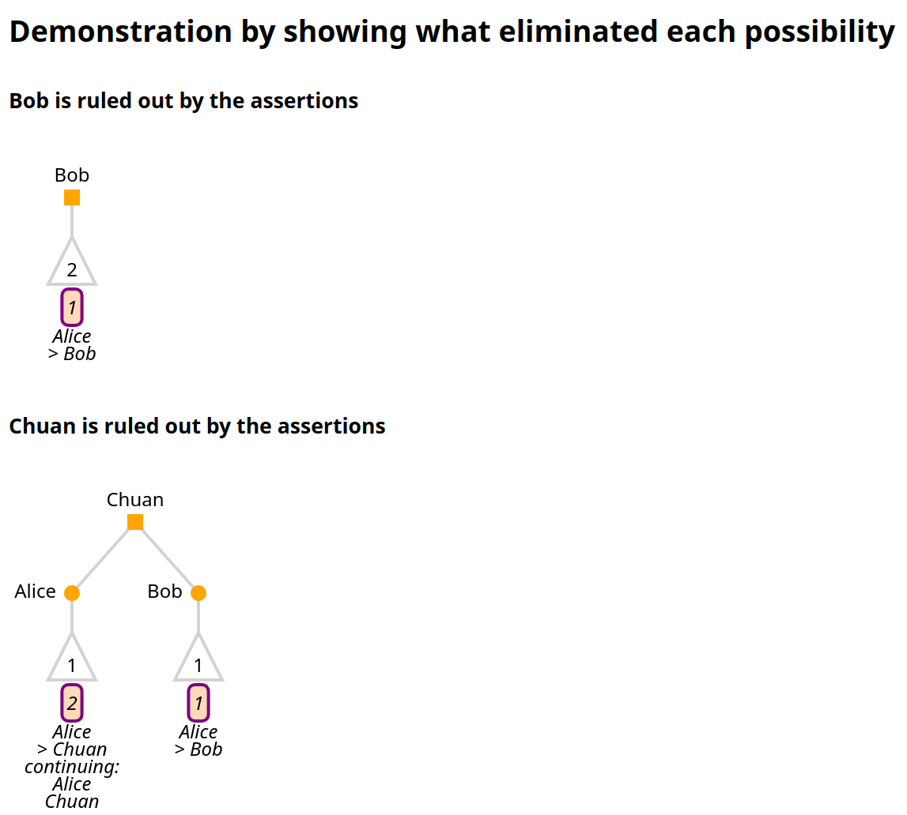
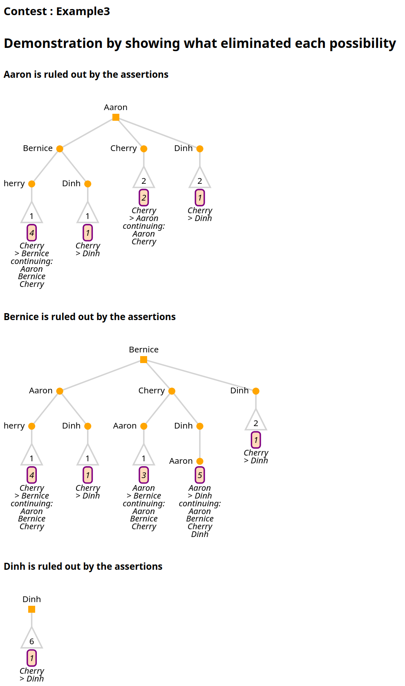

This directory contains the http files for loading up the database intended to be used for demo 1.
This approach is generally superseded by the [workflow instances](src/test/resources/workflows/instances).
These http scripts do not implement all relevant tests - the workflows are much more comprehensive,
but these are left in case they are helpful. 

# Setup
Before running these demos, 
- drop all tables from the corla database,
- run colorado-rla by following the 
[developer instructions](https://github.com/DemocracyDevelopers/colorado-rla/blob/main/docs/25_developer.md), 
- including loading the test credentials from colorado-rla/test/corla-test-credentials.psql.
- Run the raire-service by following its [README](https://github.com/DemocracyDevelopers/raire-service).

Both the raire-service and colorado-rla need to be running while the demos are running.

# Running Demo 1.
Now you should be able to run demo http files by clicking on the double-green-arrow in IntelliJ. 
Run them in the `dev` environment, which appears as a drop down after 'Run with' if you open the .http
file in the IntelliJ editor. This loads some variables from `http-client.env.json`. 
To run the complete demo, execute the following:
- `demo1_loadCVRs.http`
- `demo1_loadManifests.http`
- `Boulder_loadCVRs.http`
- `Boulder_loadManifests.http`
- `demo1_defineAudit.http`
- `county-2-Alamosa-do-audit.http`

The first 4 can run in any order, but they can take a while - make sure they're finished before running `demo1_defineAudit` and then `county-2-Alamosa-do-audit`.
The total number of CVRs in Demo1 is 154939.

## Examining the output.
`demo1-defineAudit` prints into the console a list of 'ballots remaining in round' for all contests. Counties 4 and 7 should have hundreds of ballots to audit; the rest should have a range of values from 0 to about 6.

It also saves the sample sizes and assertions files in the `workflows/demo-stored-data` directory.

`county-2-Alamosa-do-audit` prints the requested audit ballot IDs to the console - there should be two.

## Details of the data.
 
The NSW 2021 Byron Mayoral contest has been spread across all 64 Colorado counties 
These are stored in `src/test/resources/CSVs/split-Byron`.

Five counties have their own data, to which the split Byron data has been added.
These are loaded from `src/test/resources/CSVs/Demo1`.

- Adams County has test data from AdamsAndAlamosa, with 284 Byron Mayoral votes from Byron-1.csv appended. `Demo1` uses the ballot manifests from AdamsAndAlamosa.
- Alamosa County has test data from AdamsAndAlamosa, with 284 Byron Mayoral votes Byron-2.csv appended. `Demo1` uses the ballot manifests from AdamsAndAlamosa.
- Arapahoe has 284 Byron Mayoral votes from `Byron-3.csv`, with the tied IRV contest from `Tiny-IRV-Examples/ThreeCandidatesTenVotes_TiedIRV` appended to make `/Demo1/3-arapahoe-Byron-3-plus-tied-irv.csv`. `Demo1` uses the ballot manifest `split-Byron/Byron-3-manifest.csv`.
- Archuleta has the votes from `NewSouthWales/Kempsey_Mayoral.csv`, with 131 Byron Mayoral votes from `Byron-4.csv` appended to make 4-archuleta-kempsey-plusByron-4.csv. `Demo1` uses the ballot manifest `NewSouthWales/Kempsey_Mayoral.manifest.csv`.
- Boulder has the redacted real data from Boulder23, with 284 Byron Mayoral votes from `Byron-7.csv` appended to make `7-boulder-2023-plusByron-7.csv`. `Boulder_loadManifest.http` uses Boulder's manifest from `Boulder23/Boulder-IRV-Manifest.csv`.
 
For each other county n, the demo loads `split-Byron/Byron-n.csv` and uses the accompanying manifest.  

Each of the .http files can be used independently if you like. For example, if you want to test whether Sample Size estimation works without manifests, run `Boulder_loadCVRs` and `demo1_loadCVRs.http`
then hit the sample size estimation endpoint.

# Running the NSW Demo

Very similar to Demo 1.
To run the complete demo, set the environment to 'dev' and execute the following:
- `NSW_demo_loadCVRs.http`
- `NSW_demo_loadManifests.http`
- `NSW_defineAudit.http`

# Running the Tiny IRV Demo

Very similar to the other demos.
To run the complete demo, set the environment to 'dev' and execute the following:
- `TinyIRV_demo_loadCVRs.http`
- `TinyIRV_demo_loadManifests.http`
- `TinyIRV_defineAudit.http`

## Details of the data
- Lake County (33) has the TinyExample1 IRV contest, plus a tied and a non-tied plurality contest.
- La Plata County (34) has an example of TinyExample1 that is meant to contain
  - an invalid contest name (TinyInvalidExample should be canonicalized to TinyExample1),
  - an invalid candidate name (Alicia should be canonicalized to Alice),
  - invalid IRV votes (e.g. repeated or missing ranks).
- Larimer County (35) has a TiedIRV contest.
- Las Animas County (36) has the Guide To Raire Example 3.

## Running it manually
This demo is well suited to running manually with the client UI. All of the data files are available
in `src/test/resources/CSVs/Tiny-IRV-Examples`. For every file `x.y` requiring a sha256sum, the directory
also contains it in a file called `x.y.sha256sum`.

### County data upload.
   - Log in as countyadmin33 (Lake) and upload CVRs `ThreeCandidatesTenVotesPlusTiedPlurality.csv`
     and manifest `ThreeCandidatesTenVotes_Manifest.csv`.
   - Log in as countyadmin34 (La Plata) and upload CVRs `ThreeCandidatesTenInvalidVotes.csv` 
     and manifest `ThreeCandidatesTenVotes_Manifest.csv`.   
   - Log in as countyadmin35 (Larimer) and upload CVRs `ThreeCandidatesTenVotes_TiedIRV.csv`
     and manifest `ThreeCandidatesTenVotes_Manifest.csv`.
   - Log in as countyadmin36 (Las Animas) and upload CVRs `GuideToRAIREExample3.csv`
     and manifest `GuideToRAIREExample3-manifest.csv`.
### Defining the audit. 
   1. Log in as stateadmin. Choose any dates you like, and a risk limit of 0.03.
   2. Upload Tiny_IRV_Demo_Canonical_List.csv as the canonical list file.
   3. At the 'Standardize contest names' step, canonicalize 'TinyInvalidExample1' to 'TinyExample1' as colorado-rla suggests.
   4. At the 'Standardize choice names' step, canonicalize A to Aaron, B to Bernice, C to Cherry and D to Dinh.
   5. Generate the assertions. You should see successes for Example3 (Las Animas) and TinyExample1 (Multiple), and a 
        TIED_WINNERS failure for Tied_IRV. Download the .json and .csv assertion files.
   6. Download the sample size estimate csv.
   7. At the 'Select contests' page, choose Example3 (County Contest) and TinyExample1 (State Contest).
     The TiedIRV checkbox should be disabled because it is not auditable. 
   8. Enter the seed (our example is "23987213984712389471238947129384128974").
   9. Launch the audit. I see 5 remaining ballots to audit in Lake and La Plata Counties and 57 in Las Animas, but you will
     see different numbers if you chose a different risk limit or seed. (Technical note: 5 + 5 < 13, so it might seem
     as if we are going to audit fewer ballots than the expected sample size, but this can happen - especially in small 
     contests - because an audit ballot can be repeated in the sample.)

Alternatively, all these steps can be done without manifests, in which case the CDOS audit sequence
blocks after sample size estimation. For this data, the sample size estimates should be the same
with or without manifests.

### Auditing ballots - Lake and La Plata.
We will audit all 5 ballots for Lake and La Plata, with no errors. 

1. Log in as countyadmin33 (Lake), sign in to the audit board and click `start audit`.
Enter the following (correct) audit ballots:

| Imprinted ID | TinyExample1 vote        | PluralityTiedExample vote | PluralityExample2 vote |
| :------------| :------------------------| :-------------------------| :----------------------|
| 1-1-2        | Alice(1),Bob(2),Chuan(3) | Farhad                    | Imogen                 |
| 1-1-4        | Alice(1),Chuan(2),Bob(3) | Farhad                    | Gertrude, Ho           |
| 1-1-6        | Alice(1),Chuan(2),Bob(3) | Diego                     | Gertrude, Ho           |
| 1-1-7        | Bob(1),Alice(2),Chuan(3) | Diego                     | Gertrude, Ho           |
| 1-1-10       | Chuan(1),Alice(2),Bob(3) | Eli                       | Gertrude, Ho           |
 
Finalize the review, then click `Review complete - Finish Round` and sign off.

2. Log in as countyadmin34 (Larimer), sign in to the audit board and click `start audit`.
Enter the following (correct but invalid) audit ballots:

| Imprinted ID | TinyExample1 vote                          |
| :------------| :------------------------------------------|
| 1-1-1        | Alice(1),Alice(2),Bob(2),Chuan(3)          |
| 1-1-2        | Alice(1),Bob(2),Alice(3),Chuan(3)          |
| 1-1-3        | Alice(1),Alice(2),Bob(2),Alice(3),Chuan(3) |
| 1-1-7        | Alice(1),Chuan(3)                          |
| 1-1-9        | Alice(1),Chuan(1),Alice(2),Bob(3)          |

Finalize the review, then click `Review complete - Finish Round` and sign off.

3. Log in as stateadmin. 
In contest updates, you should see TinyExample1 with 0 discrepancies and 0 ballots to audit.
Example 3 has 66 ballots to audit.

In county updates, you should see Lake and La Plata as
`waiting for round start` with 5 submitted and 0 remaining in round. Las Animas has 57 to go (which
is 66 but with some samples repeated.)

### Auditing ballots - Las Animas - adding discrepancies 
We will add 2 discrepancies to Example3, one affecting the sample size and the other not.

1. Log in as countyadmin36 (Las Animas). Introduce a +2 discrepancy by entering the following:

| Imprinted ID | Example3 vote    |
| :------------| :----------------| 
| 1-1-4        | Aaron(1),Dinh(2) |

This introduces a +2 discrepancy for the lowest-margin assertion, relative to the CVR, which is
Cherry(1),Dinh(2).

2. Log in as stateadmin. In county updates, you should see that Las Animas has 1 discrepancy and 56
remaining in the round. In contest updates, you should see that Example3 has 1 discrepancy and 253
est remaining to audit.

3. As countyadmin36, continue the audit by entering:

| Imprinted ID | Example3 vote                |
| :------------| :----------------------------|
| 1-1-8        | Cherry(1),Bernice(2),Dinh(3) |

This is a discrepancy because the CVR says Cherry(1),Dinh(2). However, this discrepancy affects no
assertions so does not count in the discrepancy tally. 

4. As stateadmin, in county updates, you should see Las Animas with 1 discrepancy and 54 remaining
in the round. In contest updates, Example3 should have 1 discrepancy and 189 est remaining to audit.

Download the reports - click `Choose report to download` and then `Download All`.

## Examining the output
Expected output files are in `src/test/resources/workflows/expected-ouputs/TinyIRV` for comparison.
`Pre-audit` contains the files from the setup stage, before auditing any ballots. The `Audit_Report`
folder should match what you get from Downloading all reports at the end.
Main points are described here.

### The pre-audit assertions csv files
You should see NO_ASSERTIONS_PRESENT for Tied_IRV, two assertions for TinyExample1, and five for Example3.
The current risks for each assertion, and overall, are 1 because no auditing has occurred.

The closest assertion for TinyExample1 is NEN(Alice, Chuan) with Alice and Chuan remaining---this has
a margin of 12, leading to a diluted margin of 0.6 and hence Estimated and Optimistic sample sizes of 13.

The closest assertion for Example3 is NEN(Cherry, Aaron) with Aaron and Cherry remaining---this has
a margin of 25, leading to a diluted margin of 0.1111 and hence Estimated and Optimistic sample sizes of 66.

### The pre-audit assertions json files
You can paste the .json assertions into the (Assertion Explainer)[https://democracydevelopers.github.io/raire-rs/WebContent/explain_assertions.html].

For TinyExample1, you should see

For Example3, you should see

### sample-sizes csv
The sample sizes should match the Estimated samples to audit from the assertion .csv files.
- Tied_IRV and PluralityTiedExample should be 0, because they are not auditable,
- TinyExample1 should be 13,
- Example3 should be 66,
- PluralityExample2 should be 10.

### The Audit_Report assertions csv files
After auditing, the `TinyExample1_assertions.csv` file shows no discrepancies and a current risk of 0.01,
for both assertions and overall. This indicates successful completion.

The `Example3_assertions.csv` file shows a 2-vote overcount for assertions 1 and 2, a one vote overcount
for assertion 4, one-vote undercounts for assertions 3 and 5, and an overall risk of 1. You can check 
this against the discrepancy you introduced in Step 1 of Auditing ballots in Las Animas.

### The Audit_Report assertions json files
These can be entered into the assertion explainer and should look the same as the pre-audit json 
files.

### ranked_ballot_interpretation file
This file shows how colorado-rla interpreted IRV ranks that were invalid, including duplicated
candidates, repeated ranks or skipped preferences. You can check that these follow the rules 
specified by CDOS---see the example file in `TinyIRV/AuditReport`.

### ResultsReport.xls
In the summary sheet, the min margins should be 25 for Example3 and 12 for TinyExample1, as above. 
Audited ballots are 2 for Example 3 and 14 for TinyExample1 (i.e. 10 with repeats). There is 1 
2-vote overstatement (a '+2' discrepancy), but note that there is no '+1' discrepancy listed on this 
summary, because the '+1 discrepancy did not affect the lowest-margin assertion.

The Risk measurement is 100 for Example3 (which was only partially audited) and the non-audited 
contests, and 0.8\\% (i.e. 0.008) for TinyExample1, well below the risk limit. (The example
`ResultsReport.xls` has some repeated values in the TinyExample1 tab, which your copy will not have.)

### summarize_IRV
This file summarizes what happended for IRV assertion generation. It shows the same information as
was shown to the user during the assertion generation step. You should see

| contest_name | target_reason       | winner | error        | message                    |
| :------------| :-------------------| :------| :------------| :--------------------------|
| TinyExample1 | STATE_WIDE_CONTEST  | Alice  |              |                            | 
| Example3     | COUNTY_WIDE_CONTEST | Cherry |              |                            | 
| Tied_IRV     | Not targeted        |        | TIED_WINNERS | Tied winners: Alice, Chuan |
